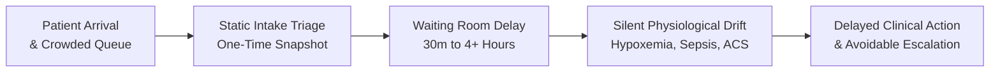
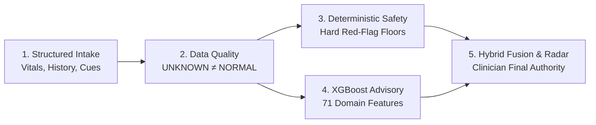
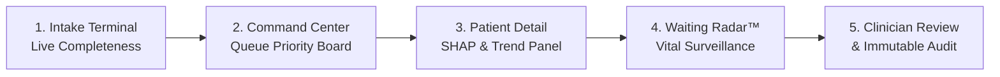
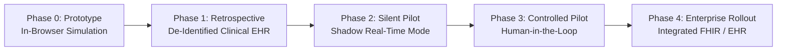
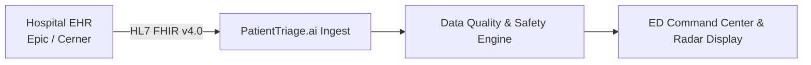

# PatientTriage.ai

## Business Proposal
### Continuous Emergency Department Safety Monitoring & Hybrid Decision Support
*From static triage to continuous waiting-room safety awareness*

**Document Type**: Competition Business Proposal & Executive Strategy
**System Status**: Functional Decision-Support Prototype
**Evaluation Evidence**: Synthetic Demonstration Benchmarks & Exploratory Generalization
**Repository**: [https://github.com/sahilsheoran999/patient_triage](https://github.com/sahilsheoran999/patient_triage)

---

```
┌────────────────────────────────────────────────────────────────────────────────────────┐
│                                   THE CORE CONCEPT                                     │
├────────────────────────────────────────────────────────────────────────────────────────┤
│                                                                                        │
│     STATIC INTAKE TRIAGE                   WAITING-ROOM RISK DRIFT                     │
│   Point-in-time assessment   ─────────>   Unmonitored clinical changes                 │
│   at arrival (t = 0)                      during extended queue waits                  │
│                                                        │                               │
│                                                        ▼                               │
│     CLINICIAN FINAL CONTROL                CONTINUOUS SAFETY RADAR™                    │
│   100% human-in-the-loop     <─────────   Longitudinal vital tracking                  │
│   override & governance                   & contextual alert diffs                     │
│                                                                                        │
└────────────────────────────────────────────────────────────────────────────────────────┘
```

> [!WARNING]
> ### PROTOTYPE SIMULATION & REGULATORY NOTICE
> **PatientTriage.ai is a clinical decision-support prototype designed for emergency department triage surveillance.**
> * **Prototype Demonstration**: All operational workflows, triage trajectories, and simulation models are demonstrated on synthetic datasets.
> * **No Autonomous Clinical Action**: The software does not diagnose medical conditions, recommend drug therapies, or replace human clinical judgment.
> * **Hierarchy of Authority**: Licensed healthcare practitioners retain 100% final decision authority. Deterministic safety rules establish non-downgradable safety floors that advisory machine learning models cannot lower.
> * **Regulatory Posture**: Commercial deployment is subject to formal retrospective validation, prospective clinical trials, Institutional Review Board (IRB) approval, cybersecurity certification, and regulatory clearance (e.g., SaMD review by CDSCO, US FDA, or European CE mark authorities).

<!-- PAGE BREAK -->

## 1. Executive Summary & Table of Contents

Emergency departments (EDs) worldwide face unprecedented operational challenges: severe patient overcrowding, acute clinical nursing shortages, and unpredictable volume surges. Under conventional five-level triage systems (e.g., ESI, MTS), patients receive a static, one-time acuity rating at intake. However, human physiology is dynamic; during prolonged waiting periods stretching into hours, patients initially categorized as moderate or low acuity can silently deteriorate before receiving bedside evaluation.

**PatientTriage.ai** transforms emergency triage from an isolated intake snapshot into an active, continuous safety monitoring workflow by pairing deterministic physiological safety rules with advisory machine learning under strict clinician authority.

### Four Core Strategic Pillars

```
┌──────────────────────────────┬──────────────────────────────┐
│ 📡 CONTINUOUS SURVEILLANCE   │ 🛡️ HYBRID SAFETY FUSION      │
│ Waiting-Room Radar™ tracks   │ Deterministic rules enforce  │
│ longitudinal vital deltas and│ non-downgradable safety      │
│ wait times in real time.     │ floors over ML predictions.  │
├──────────────────────────────┼──────────────────────────────┤
│ 🔍 EXPLAINABLE AI AT POINT   │ 👩‍⚕️ CLINICIAN FINAL AUTHORITY │
│ Feature-level SHAP values    │ 100% human-in-the-loop       │
│ display mathematical drivers │ governance with mandatory    │
│ behind advisory outputs.     │ reason codes and audit logs. │
└──────────────────────────────┴──────────────────────────────┘
```

### Document Table of Contents

1. [Executive Summary & Table of Contents](#1-executive-summary--table-of-contents) — Page 2
2. [Problem Framing & The Waiting-Room Safety Gap](#2-problem-framing--the-waiting-room-safety-gap) — Page 3
3. [Solution Overview & 5-Component Architecture](#3-solution-overview--5-component-architecture) — Page 4
4. [Why the Hybrid Model: Rules + ML + Clinician Authority](#4-why-the-hybrid-model-rules--ml--clinician-authority) — Page 5
5. [Target Users & Stakeholder Value Ecosystem](#5-target-users--stakeholder-value-ecosystem) — Page 6
6. [Product Experience & Clinical Workflow](#6-product-experience--clinical-workflow) — Page 7
7. [Business Value Pillars & Pilot Value Hypotheses](#7-business-value-pillars--pilot-value-hypotheses) — Page 8
8. [Competitive Differentiation Matrix](#8-competitive-differentiation-matrix) — Page 9
9. [Responsible AI & Clinical Governance Guardrails](#9-responsible-ai--clinical-governance-guardrails) — Page 10
10. [Phased Deployment Strategy & Validation Gates](#10-phased-deployment-strategy--validation-gates) — Page 11
11. [Phased Product Roadmap](#11-phased-product-roadmap) — Page 12
12. [Comprehensive Risk & Mitigation Matrix](#12-comprehensive-risk--mitigation-matrix) — Page 13
13. [Scalability Architecture & Commercialization Models](#13-scalability-architecture--commercialization-models) — Page 14
14. [Prototype Evidence & Hospital Integration Feasibility](#14-prototype-evidence--hospital-integration-feasibility) — Page 15
15. [Conclusion & Strategic Call to Action](#15-conclusion--strategic-call-to-action) — Page 16

<!-- PAGE BREAK -->

## 2. Problem Framing & The Waiting-Room Safety Gap

Emergency departments face a fundamental structural dilemma: triage assessments occur at minute zero ($t = 0$), yet patients spend substantial time waiting in crowded waiting rooms where clinical conditions can evolve unnoticed.



### The Safety Gap: Initial Risk ≠ Permanent Risk

$$\text{Patient Risk}(t) = f\big(\text{Vitals}(t), \text{Symptoms}(t), \text{Elapsed Wait Time}(t - t_0), \Delta\text{Physiology}(t)\big)$$

Conventional triage systems treat $\Delta\text{Physiology}(t) = 0$, creating a dangerous operational gap where clinical deterioration is missed between registration and physician examination.

```
┌────────────────────────────────────────────────────────────────────────────────────────┐
│                              THREE WAITING-ROOM TRAJECTORIES                           │
├──────────────┬──────────────────────────────┬──────────────────────────────────────────┤
│ PATIENT TYPE │ INTAKE PRESENTATION          │ WAITING-ROOM DRIFT & RADAR INTERVENTION  │
├──────────────┼──────────────────────────────┼──────────────────────────────────────────┤
│ 1. Stable    │ SpO₂ 98%, HR 74, Temp 36.8°C │ Vitals remain stable across 45 minutes.  │
│    Patient   │ Minor wrist pain (ESI-4)     │ Radar maintains `SAFE` queue state.      │
├──────────────┼──────────────────────────────┼──────────────────────────────────────────┤
│ 2. Deterio-  │ SpO₂ 95%, HR 86, Mild cough  │ At t=40m, SpO₂ drops to 87% (Δ = -8%).   │
│    rating    │ Moderate baseline risk       │ Radar triggers immediate `ESCALATE` diff.│
├──────────────┼──────────────────────────────┼──────────────────────────────────────────┤
│ 3. Incomplete│ Chest discomfort, Levine sign│ Missing BP elevates uncertainty score.   │
│    Data      │ Unmeasured BP (null/missing) │ Radar flags `WATCH` + Prompts re-check.  │
└──────────────┴──────────────────────────────┴──────────────────────────────────────────┘
```

### Core Clinical Drivers of Waiting-Room Risk
* **Silent Decompensation**: Conditions like occult sepsis and atypical acute coronary syndromes progress without immediate overt respiratory distress.
* **Cognitive Saturation**: During volume surges, triage staff managing 50+ patients cannot manually recalculate trend lines or monitor time limits.
* **Unsafe Imputation**: Rushed staff frequently assume omitted vitals are normal, concealing high-risk presentations.

<!-- PAGE BREAK -->

## 3. Solution Overview & 5-Component Architecture

PatientTriage.ai replaces static triage scoring with an end-to-end clinical decision-support ecosystem built on five core architectural components:



```
┌────────────────────────────────────────────────────────────────────────────────────────┐
│                         FIVE CORE ARCHITECTURAL COMPONENTS                             │
├─────────────────────┬──────────────────────────────────────────────────────────────────┤
│ 1. Patient Intake   │ Rapid, structured capture of vital signs, chief complaints with  │
│                     │ negation protection, past medical history, and clinical signs.   │
├─────────────────────┼──────────────────────────────────────────────────────────────────┤
│ 2. Data Quality     │ `UNKNOWN ≠ NORMAL` governance: unmeasured vitals reduce data     │
│                     │ completeness and elevate uncertainty rather than defaulting.     │
├─────────────────────┼──────────────────────────────────────────────────────────────────┤
│ 3. Deterministic    │ Non-negotiable physiological red-flag thresholds that establish  │
│    Safety Rules     │ unbreachable `CRITICAL` safety floors (Safety Authority).        │
├─────────────────────┼──────────────────────────────────────────────────────────────────┤
│ 4. XGBoost Advisory │ 71-feature multi-class ensemble providing continuous probability │
│    Intelligence     │ estimates and SHAP mathematical attributions (Advisory Signal).  │
├─────────────────────┼──────────────────────────────────────────────────────────────────┤
│ 5. Continuous Radar │ Waiting-Room Radar™ longitudinal surveillance tracking elapsed   │
│    & Human Control  │ wait times and vital deltas under 100% Clinician Authority.      │
└─────────────────────┴──────────────────────────────────────────────────────────────────┘
```

### Clear Authority Separation

```
┌────────────────────────────────────────────────────────────────────────────────────────┐
│ 🟢 CLINICIAN: Final Decision Authority (100% Override Authority with Audit Trail)      │
│ 🔴 SAFETY RULES: Safety Authority (Unbreachable CRITICAL Physiological Floors)         │
│ 🟡 XGBOOST MODEL: Advisory Signal Only (71 Features; Cannot Downgrade Safety Floors)   │
│ 🔵 DATA QUALITY: Safety Constraint (`UNKNOWN ≠ NORMAL` Uncertainty Enforcement)        │
└────────────────────────────────────────────────────────────────────────────────────────┘
```

<!-- PAGE BREAK -->

## 4. Why the Hybrid Model: Rules + ML + Clinician Authority

A fundamental product differentiator of PatientTriage.ai is its rejection of both "pure rules" and "pure machine learning" in favor of a **Hybrid Safety Fusion** paradigm:

```
┌────────────────────────────────────────────────────────────────────────────────────────┐
│                              THREE-WAY PARADIGM COMPARISON                             │
├──────────────────────┬──────────────────────────────┬──────────────────────────────────┤
│ PARADIGM             │ CORE CAPABILITIES            │ SYSTEMIC LIMITATIONS             │
├──────────────────────┼──────────────────────────────┼──────────────────────────────────┤
│ Pure Rules Engine    │ • Deterministic & auditable  │ • Rigid boundary thresholds      │
│                      │ • Verifiable safety bounds   │ • Blind to non-linear patterns   │
│                      │ • 100% predictable outcomes  │ • High false-negative rate (45%) │
├──────────────────────┼──────────────────────────────┼──────────────────────────────────┤
│ Pure Machine Learning│ • Complex multi-factor risk  │ • "Black box" unpredictability   │
│                      │ • High sensitivity (98.9%)   │ • Unsafe edge-case downgrades    │
│                      │ • Continuous probabilities   │ • Vulnerable to missing data     │
├──────────────────────┼──────────────────────────────┼──────────────────────────────────┤
│ PATIENTTRIAGE.AI     │ • Best of both paradigms     │ • Requires dual-rule maintenance │
│ HYBRID SAFETY FUSION │ • Absolute safety floors     │ • Dependent on clinician review  │
│                      │ • Advanced pattern discovery │ • Prototype validation needed    │
│                      │ • Explainable SHAP factors   │                                  │
└──────────────────────┴──────────────────────────────┴──────────────────────────────────┘
```

### Key Architectural Strengths

```
┌────────────────────────────────────────────────────────────────────────────────────────┐
│                               WHY HYBRID SAFETY FUSION WINS                            │
├──────────────────────┬─────────────────────────────────────────────────────────────────┤
│ 1. Safety Floor      │ When a patient presents with extreme vitals (e.g., SpO₂ < 88%), │
│    Enforcement       │ deterministic rules force CRITICAL. ML cannot downgrade acuity. │
├──────────────────────┼─────────────────────────────────────────────────────────────────┤
│ 2. Subtle Risk       │ In complex multi-symptom presentations where individual vitals  │
│    Detection         │ are borderline, XGBoost detects interactions and upgrades acuity│
├──────────────────────┼─────────────────────────────────────────────────────────────────┤
│ 3. Clinician Trust   │ Clinicians trust systems that have explicit, verifiable guard-  │
│    & Adoption        │ rails rather than opaque probability distributions alone.       │
└──────────────────────┴─────────────────────────────────────────────────────────────────┘
```

> **Central Governance Doctrine**:
> *"Machine learning advises. Deterministic safety rules protect. Clinicians decide."*

<!-- PAGE BREAK -->

## 5. Target Users & Stakeholder Value Ecosystem

PatientTriage.ai creates aligned clinical and operational value across all acute-care stakeholders:

```
┌────────────────────────────────────────────────────────────────────────────────────────┐
│                                STAKEHOLDER VALUE MATRIX                                │
├──────────────────────┬──────────────────────────────┬──────────────────────────────────┤
│ STAKEHOLDER          │ CORE OPERATIONAL PAIN POINT  │ PATIENTTRIAGE.AI VALUE DELIVERED │
├──────────────────────┼──────────────────────────────┼──────────────────────────────────┤
│ 👩‍⚕️ Triage Registered│ • Cognitive surge overload   │ • Automated longitudinal radar   │
│    Nurses (RNs)      │ • Unmonitored waiting queues │ • Contextual "Why Now?" alerts   │
│                      │ • Fear of AI black boxes     │ • 100% human override authority  │
├──────────────────────┼──────────────────────────────┼──────────────────────────────────┤
│ 🏥 ED Leadership &   │ • Bottlenecks & wait times   │ • Surge Mode volume management   │
│    Flow Coordinators │ • Unpredictable surge crises │ • Real-time queue visibility     │
│                      │ • Regulatory compliance      │ • Standardized reassessment time │
├──────────────────────┼──────────────────────────────┼──────────────────────────────────┤
│ ⚖️ Clinical Safety & │ • Diagnostic drift liability │ • Tamper-evident audit logging   │
│    Risk Management   │ • Unexplained AI decisions   │ • Feature-level SHAP evidence    │
│                      │ • Missing data vulnerability │ • Zero silent default imputation │
├──────────────────────┼──────────────────────────────┼──────────────────────────────────┤
│ 🧑‍🤝‍🧑 Patients &      │ • Long anxious wait times    │ • Timely clinical escalation     │
│    Families          │ • Risk of silent in-queue    │ • Safer waiting-room environment │
│                      │   decompensation             │                                  │
└──────────────────────┴──────────────────────────────┴──────────────────────────────────┘
```

### Four Value Pillars Created

```
┌──────────────────────────────┬──────────────────────────────┐
│ 🛡️ SAFETY AWARENESS          │ 📊 WORKFLOW VISIBILITY       │
│ Real-time vital-trend delta  │ Centralized queue telemetry  │
│ surveillance in waiting room.│ with Surge Mode adaptation.  │
├──────────────────────────────┼──────────────────────────────┤
│ 💡 MATHEMATICAL EXPLAINABILITY│ 📜 AUDITABLE GOVERNANCE      │
│ Local SHAP attributions for  │ Immutable event stream with  │
│ every AI advisory output.    │ mandatory override reasons.  │
└──────────────────────────────┴──────────────────────────────┘
```

<!-- PAGE BREAK -->

## 6. Product Experience & Clinical Workflow

The PatientTriage.ai interface is designed for high-stress, low-latency emergency environments:



### Five Core User Interface Modules

```
┌────────────────────────────────────────────────────────────────────────────────────────┐
│                              FIVE CORE INTERFACE MODULES                               │
├──────────────────────┬─────────────────────────────────────────────────────────────────┤
│ 1. Command Center    │ Real-time priority queue featuring risk scores, model class     │
│                      │ probabilities, uncertainty badges, and Surge Mode controls.     │
├──────────────────────┼─────────────────────────────────────────────────────────────────┤
│ 2. Waiting-Room Radar│ Longitudinal monitoring grid tracking elapsed wait times against│
│                      │ acuity limits with 4 states: SAFE, WATCH, REASSESS, ESCALATE.   │
├──────────────────────┼─────────────────────────────────────────────────────────────────┤
│ 3. Patient Intake    │ Structured triage terminal enforcing explicit null handling     │
│                      │ (UNKNOWN ≠ NORMAL) with live data completeness gauge.           │
├──────────────────────┼─────────────────────────────────────────────────────────────────┤
│ 4. Patient Detail    │ 4-Stat clinical bar, vital trend charts, SHAP feature importance│
│    Modal             │ decomposition, and transparent rule factor breakdown.           │
├──────────────────────┼─────────────────────────────────────────────────────────────────┤
│ 5. Override & Audit  │ Single-click priority override with mandatory reason codes,     │
│    Trail Log         │ clinician notes, and tamper-evident event streaming.            │
└──────────────────────┴─────────────────────────────────────────────────────────────────┘
```

### Operational Workflow Efficiency
* **Sub-Minute Intake**: Triage nurses enter structured vitals and clinical cues in $< 45\text{ seconds}$.
* **Zero-Latency Scoring**: Client-side TypeScript inference computes hybrid recommendations in milliseconds.
* **Contextual Alerts**: When deterioration occurs, Radar displays exact vital deltas ($\Delta\text{SpO}_2, \Delta\text{HR}$) in a "Why Now?" banner, eliminating guesswork.

<!-- PAGE BREAK -->

## 7. Business Value Pillars & Pilot Value Hypotheses

> [!NOTE]
> All economic and operational impacts represent **business hypotheses for future pilot validation** rather than guaranteed claims. Real-world financial impact must be validated through prospective hospital trials.

### Four Business Value Pillars

```
┌──────────────────────────────┬──────────────────────────────┐
│ 1. PATIENT SAFETY AWARENESS  │ 2. CLINICAL WORKFLOW GAINS   │
│ Active surveillance surfaces │ Prioritizes nurse attention  │
│ changing risk continuously.  │ toward high-risk re-checks.  │
├──────────────────────────────┼──────────────────────────────┤
│ 3. OPERATIONAL VISIBILITY    │ 4. GOVERNANCE & AUDITABILITY │
│ Centralized dashboard tracks │ Complete audit trail of all  │
│ surge capacity in real time. │ overrides and recommendations│
└──────────────────────────────┴──────────────────────────────┘
```

### Potential Operational & Economic Value Hypotheses
* **Earlier Deterioration Capture**: Designed to detect vital desaturations 15–30 minutes earlier during waiting-room delays.
* **Reduced Escalation Severity**: Timely identification of decompensating patients may prevent avoidable ICU transfers from waiting rooms.
* **Nursing Cognitive Relief**: Eliminates manual mental calculations of age-adjusted vitals and wait-time limits during surges.

### Proposed Controlled Pilot Success Metrics

```
┌────────────────────────────────────────────────────────────────────────────────────────┐
│                              PILOT SUCCESS MEASUREMENT PLAN                            │
├─────────────────────┬───────────────────────────┬──────────────────────────────────────┤
│ PILOT DIMENSION     │ TARGET SUCCESS METRIC     │ MEASUREMENT METHODOLOGY              │
├─────────────────────┼───────────────────────────┼──────────────────────────────────────┤
│ Alert Precision     │ ≥ 80% clinical relevance  │ Clinician rating on "Why Now?" alerts│
│ Alert Burden        │ ≤ 2.5 alerts/nurse/hour   │ System telemetry event logging       │
│ Response Latency    │ < 5 minutes to review     │ Timestamped audit log verification   │
│ Deterioration Capt. │ 0 missed red-flag events  │ Retrospective safety committee audit │
│ Clinician Agreement │ ≥ 85% voluntary adoption  │ Override frequency tracking in audit │
│ Data Completeness   │ ≥ 90% vitals capture rate │ Live intake completeness telemetry   │
└─────────────────────┴───────────────────────────┴──────────────────────────────────────┘
```

<!-- PAGE BREAK -->

## 8. Competitive Differentiation Matrix

```
┌────────────────────────────────────────────────────────────────────────────────────────┐
│                             COMPETITIVE LANDSCAPE MATRIX                               │
├─────────────────────────┬───────────┬───────────┬──────────────┬───────────────────────┤
│ CAPABILITY              │ STATIC    │ RULE-ONLY │ BLACK-BOX ML │ PATIENTTRIAGE.AI      │
│                         │ ESI / MTS │ CDSS      │ TRIAGE APPS  │ HYBRID PLATFORM       │
├─────────────────────────┼───────────┼───────────┼──────────────┼───────────────────────┤
│ Continuous Queue Radar  │ ❌ No     │ ❌ No     │ ❌ Rare      │ 🟢 **Active Radar™**   │
│ Deterministic Safety Flr│ ⚠️ Heuristic│ 🟢 Yes    │ ❌ No        │ 🟢 **Hard Floors**    │
│ Multi-Variable ML Model │ ❌ No     │ ❌ No     │ 🟢 Yes       │ 🟢 **71 Features**    │
│ Transparent SHAP Engine │ ❌ No     │ ⚠️ Limited│ ❌ Black Box │ 🟢 **Feature SHAP**   │
│ `UNKNOWN ≠ NORMAL` Rule │ ❌ No     │ ⚠️ Incomplete│ ❌ Imputes  │ 🟢 **Strict Rule**    │
│ In-Browser Edge Compute │ ❌ N/A    │ ⚠️ Server │ ⚠️ Heavy Cloud│ 🟢 **Zero-Latency**  │
│ Immutable Audit Logging │ ⚠️ Basic  │ ⚠️ Variable│ ⚠️ Variable │ 🟢 **Event Trail**    │
│ Clinician 100% Override │ 🟢 Manual │ 🟢 Manual │ ⚠️ Advisory  │ 🟢 **Mandatory Codes**│
└─────────────────────────┴───────────┴───────────┴──────────────┴───────────────────────┘
```

### Strategic Market Positioning
* **Not an EHR Replacement**: PatientTriage.ai is designed as a lightweight decision-support layer that integrates with existing hospital EHR systems via standard FHIR protocols.
* **Safety-First Architecture**: Unlike black-box ML tools that attempt autonomous decision-making, PatientTriage.ai subordinates statistical models to deterministic safety rules and licensed human oversight.
* **Low IT Burden**: In-browser TypeScript execution eliminates expensive server-side GPU hosting requirements.

<!-- PAGE BREAK -->

## 9. Responsible AI & Clinical Governance Guardrails

PatientTriage.ai is architected strictly in accordance with international Responsible AI and Software as a Medical Device (SaMD) principles:

```
┌────────────────────────────────────────────────────────────────────────────────────────┐
│                               CLINICAL GOVERNANCE FLOW                                 │
├────────────────────────────────────────────────────────────────────────────────────────┤
│                                 👩‍⚕️ CLINICIAN                                          │
│                           [100% FINAL AUTHORITY]                                       │
│                                      ▲                                                 │
│                                      │ Accepts or Overrides with mandatory reason code │
│                                      │                                                 │
│                        🔴 DETERMINISTIC SAFETY RULES                                   │
│                           [SAFETY FLOOR AUTHORITY]                                     │
│                                      ▲                                                 │
│                                      │ Blocks ML downgrades on Critical Vitals         │
│                                      │                                                 │
│                         🟡 XGBOOST ADVISORY MODEL                                      │
│                            [71 DOMAIN FEATURES]                                        │
│                                      ▲                                                 │
│                                      │ Informs multi-variable subtle patterns          │
│                                      │                                                 │
│                          🔵 DATA QUALITY ENGINE                                        │
│                        [`UNKNOWN ≠ NORMAL` RULE]                                       │
└────────────────────────────────────────────────────────────────────────────────────────┘
```

### Four Governance Guardrails

```
┌────────────────────────────────────────────────────────────────────────────────────────┐
│                             FOUR ETHICAL & CLINICAL GUARDRAILS                         │
├──────────────────────┬─────────────────────────────────────────────────────────────────┤
│ 1. Clinician Final   │ AI never replaces human judgement; clinicians retain complete   │
│    Authority         │ authority to override system recommendations with audit logging.│
├──────────────────────┼─────────────────────────────────────────────────────────────────┤
│ 2. Explainability    │ UI explicitly notes that SHAP values reflect mathematical tree  │
│    Boundaries        │ contributions, not pathophysiological causation.                │
├──────────────────────┼─────────────────────────────────────────────────────────────────┤
│ 3. Anti-Automation   │ Prominent visual disagreement badges require active human       │
│    Complacency       │ confirmation to prevent passive rubber-stamping of AI outputs.  │
├──────────────────────┼─────────────────────────────────────────────────────────────────┤
│ 4. Data Minimization │ System operates strictly on de-identified tokens (`P-***`),     │
│    & Privacy         │ maintaining HIPAA and GDPR confidentiality standards.           │
└──────────────────────┴─────────────────────────────────────────────────────────────────┘
```

<!-- PAGE BREAK -->

## 10. Phased Deployment Strategy & Validation Gates

A responsible, multi-stage deployment model ensures clinical safety, operational readiness, and regulatory compliance before any hospital integration:



```
┌────────────────────────────────────────────────────────────────────────────────────────┐
│                              FIVE-PHASE DEPLOYMENT GATING                              │
├──────────┬───────────────────────────┬─────────────────────────────────────────────────┤
│ PHASE    │ OPERATIONAL FOCUS         │ MANDATORY EXIT / GATING CRITERIA                │
├──────────┼───────────────────────────┼─────────────────────────────────────────────────┤
│ Phase 0  │ In-Browser Simulation     │ • Zero synthetic holdout critical misses        │
│          │ (Current State)           │ • 100% functional test passing                  │
├──────────┼───────────────────────────┼─────────────────────────────────────────────────┤
│ Phase 1  │ Retrospective Validation  │ • External generalization on multi-center EHR   │
│          │                           │ • Statistical calibration curves verified       │
├──────────┼───────────────────────────┼─────────────────────────────────────────────────┤
│ Phase 2  │ Silent Shadow Pilot       │ • Runs in background without nurse visibility   │
│          │                           │ • Measure alert frequency & false-positive rate │
├──────────┼───────────────────────────┼─────────────────────────────────────────────────┤
│ Phase 3  │ Human-in-the-Loop Pilot   │ • Clinician-facing recommendations in 1-2 EDs   │
│          │                           │ • IRB oversight & structured nurse feedback     │
├──────────┼───────────────────────────┼─────────────────────────────────────────────────┤
│ Phase 4  │ Enterprise Rollout        │ • Full HL7/FHIR bidirectional EHR integration   │
│          │                           │ • Formal SaMD regulatory certification          │
└──────────┴───────────────────────────┴─────────────────────────────────────────────────┘
```

*Gating Policy*: Progression to each subsequent phase requires explicit sign-off from clinical safety committees and Institutional Review Boards.

<!-- PAGE BREAK -->

## 11. Phased Product Roadmap

```
┌────────────────────────────────────────────────────────────────────────────────────────┐
│                              MULTI-YEAR PRODUCT ROADMAP                                │
├────────────────────────────────────────────────────────────────────────────────────────┤
│ PHASE 1: CORE ENGINE & SIMULATION (COMPLETED PROTOTYPE)                                │
│ • 71-feature in-browser XGBoost V2 inference engine                                    │
│ • Deterministic safety engine with age-aware vital baseline normalizer                 │
│ • Waiting-Room Radar™ continuous surveillance simulation                               │
│ • Clinician override interface with immutable audit trail                              │
│                                                                                        │
│ PHASE 2: CLINICAL VALIDATION & CALIBRATION (6–12 MONTHS)                               │
│ • Multi-center de-identified clinical EHR training & validation cohorts                │
│ • Platt scaling & isotonic probability calibration curves                              │
│ • Subgroup demographic fairness & bias audits across age/gender cohorts                │
│                                                                                        │
│ PHASE 3: EHR INTEROPERABILITY & PILOTS (12–18 MONTHS)                                  │
│ • HL7 FHIR v4.0 bidirectional connectors (Epic App Orchard, Cerner Marketplace)        │
│ • Real-time bedside monitor streaming integration (SpO₂, HR telemetry)                 │
│ • Shadow nurse clinical trial in academic medical center emergency department          │
│                                                                                        │
│ PHASE 4: SPECIALTY MODULES & REGULATORY CERTIFICATION (18–30 MONTHS)                  │
│ • Pediatric-specialized emergency triage models & physiological bands                  │
│ • Pre-hospital EMS telemetry integration for incoming ambulances                       │
│ • Formal SaMD 510(k) / CE mark regulatory review submissions                           │
└────────────────────────────────────────────────────────────────────────────────────────┘
```

### Strategic Milestone Focus
* **Near-Term**: Focus entirely on statistical calibration and de-identified clinical EHR generalization.
* **Medium-Term**: Implement standard FHIR connectors to enable zero-friction hospital IT integration.
* **Long-Term**: Expand into pre-hospital telemetry and pediatric emergency pathways.

<!-- PAGE BREAK -->

## 12. Comprehensive Risk & Mitigation Matrix

```
┌────────────────────────────────────────────────────────────────────────────────────────┐
│                                 RISK MANAGEMENT MATRIX                                 │
├───────────────────┬────────┬──────────────────────────┬────────────────────────────────┤
│ IDENTIFIED RISK   │ IMPACT │ ROOT CAUSE               │ MITIGATION STRATEGY            │
├───────────────────┼────────┼──────────────────────────┼────────────────────────────────┤
│ 1. Synthetic Data │ HIGH   │ Model trained on         │ Formal multi-center validation │
│    Generalization │        │ synthetic distributions  │ on de-identified clinical EHR  │
├───────────────────┼────────┼──────────────────────────┼────────────────────────────────┤
│ 2. Alert Fatigue  │ MEDIUM │ High frequency of radar  │ Contextual "Why Now?" gating;  │
│                   │        │ notifications            │ tunable alert sensitivity      │
├───────────────────┼────────┼──────────────────────────┼────────────────────────────────┤
│ 3. ML False       │ HIGH   │ Statistical misestimate  │ Deterministic safety floor     │
│    Negatives      │        │ on atypical complaint    │ strictly prevents downgrades   │
├───────────────────┼────────┼──────────────────────────┼────────────────────────────────┤
│ 4. Automation     │ MEDIUM │ Nurses uncritically      │ Prominent disagreement badges; │
│    Complacency    │        │ accepting AI outputs     │ mandatory override reasons     │
├───────────────────┼────────┼──────────────────────────┼────────────────────────────────┤
│ 5. Missing Data   │ MEDIUM │ Nurses skipping BP /     │ `UNKNOWN ≠ NORMAL` elevates    │
│    Exploitation   │        │ vitals during rush       │ uncertainty to trigger review  │
├───────────────────┼────────┼──────────────────────────┼────────────────────────────────┤
│ 6. Regulatory     │ HIGH   │ Stringent SaMD           │ Early engagement with FDA /    │
│    Barriers       │        │ compliance requirements  │ CDSCO; hybrid CDSS posture     │
├───────────────────┼────────┼──────────────────────────┼────────────────────────────────┤
│ 7. Cybersecurity  │ HIGH   │ Hospital network breach  │ Local in-browser execution;    │
│    & HIPAA        │        │ or PHI leakage           │ zero cloud transmission of PHI │
└───────────────────┴────────┴──────────────────────────┴────────────────────────────────┘
```

*Proactive Risk Governance*: Safety risks are addressed at the architectural level through deterministic safety floors and local edge execution.

<!-- PAGE BREAK -->

## 13. Scalability Architecture & Commercialization Models

> [!NOTE]
> All commercialization models outlined below represent **illustrative future business hypotheses** for prospective evaluation, not current commercial revenue.

### Three Potential Commercialization Models

```
┌────────────────────────────────────────────────────────────────────────────────────────┐
│                         POTENTIAL COMMERCIALIZATION MODELS                             │
├────────────────────────────┬───────────────────────────────────────────────────────────┤
│ MODEL TYPE                 │ STRUCTURE & OPERATIONAL FIT                               │
├────────────────────────────┼───────────────────────────────────────────────────────────┤
│ 1. Hospital SaaS License   │ Annual subscription per ED site, tiered by annual patient │
│                            │ intake volume (e.g., <30k, 30k–70k, >70k visits).         │
├────────────────────────────┼───────────────────────────────────────────────────────────┤
│ 2. Health System Enterprise│ System-wide deployment covering multiple hospital sites    │
│                            │ with centralized analytics and cross-site telemetry.      │
├────────────────────────────┼───────────────────────────────────────────────────────────┤
│ 3. EHR App Marketplace     │ Direct integration add-on within Epic App Orchard /       │
│                            │ Oracle Cerner Marketplace via SMART-on-FHIR standard.     │
└────────────────────────────┴───────────────────────────────────────────────────────────┘
```

### Technical Scalability Advantages
* **Zero GPU Server Overhead**: In-browser TypeScript tree evaluation executes locally on triage workstations, eliminating expensive server-side inference infrastructure.
* **Configurable Hospital Profiles**: Built-in adaptation for Trauma Centers (10m wait caps), Community EDs (15m wait caps), and Rural Facilities (20m wait caps).
* **Modular Integration**: Compatible with existing hospital single sign-on (SSO), role-based access control, and audit pipelines.

<!-- PAGE BREAK -->

## 14. Prototype Evidence & Hospital Integration Feasibility

### Verified Synthetic Benchmark Metrics (2,250 Record Holdout Set)

```
┌──────────────────────────────┬──────────────────────────────┐
│ 🎯 90.79%                    │ 🚨 95.99%                    │
│ Synthetic Holdout Accuracy   │ Critical Class Recall        │
├──────────────────────────────┼──────────────────────────────┤
│ ⚡ 98.87%                    │ 🛡️ 0 Cases (0.0%)            │
│ High + Critical Sensitivity  │ Critical → Low Misses        │
└──────────────────────────────┴──────────────────────────────┘
```

*Exploratory External Data Analysis*: Evaluated on a sample of 207 labeled ESI 1–4 records from the MIMIC-IV-ED database (`ml/data/triage.csv.gz`), the domain-robust feature extraction identified $88.89\%$ ($16/18$) of Critical resuscitation cases (ESI Level 1) and $61.74\%$ ($71/115$) of High+Critical cases zero-shot without fine-tuning. *(Note: This exploratory analysis demonstrates prototype transferability under missing data conditions, but does not constitute clinical validation.)*

### Hospital EHR Integration Feasibility



* **Standard FHIR Resources**: Cleanly maps to standard FHIR `Patient`, `Observation` (vitals), `Condition` (complaints), `RiskAssessment` (triage), and `AuditEvent` (logs).
* **Zero Infrastructure Footprint**: Runs in modern web browsers without requiring local software installation or specialized client hardware.

<!-- PAGE BREAK -->

## 15. Conclusion & Strategic Call to Action

Emergency department triage cannot remain a static, one-time snapshot while patients face extended waiting times in crowded waiting rooms.

**PatientTriage.ai** establishes a viable, transparent, and clinically responsible path forward. By subordinating machine learning to deterministic physiological safety rules and anchoring all decisions in licensed clinician authority, the platform demonstrates how artificial intelligence can expand clinical situational awareness without compromising safety.

```
┌────────────────────────────────────────────────────────────────────────────────────────┐
│                                   THE CORE CALL TO ACTION                              │
├────────────────────────────────────────────────────────────────────────────────────────┤
│                                                                                        │
│                              PatientTriage.ai                                          │
│                    "See risk before it becomes a crisis."                              │
│                                                                                        │
│           • Transform static triage into continuous safety surveillance                │
│           • Enforce deterministic safety floors that ML cannot compromise              │
│           • Empower clinicians with explainable, human-in-the-loop intelligence        │
│                                                                                        │
└────────────────────────────────────────────────────────────────────────────────────────┘
```

### Strategic Next Step
*Initiate formal retrospective clinical studies on governed multi-center EHR cohorts, followed by IRB-approved silent shadow trials in academic emergency departments.*

---

*PatientTriage.ai — Clinical Decision-Support Prototype — Synthetic Demonstration Data — Not Approved for Clinical Use*

