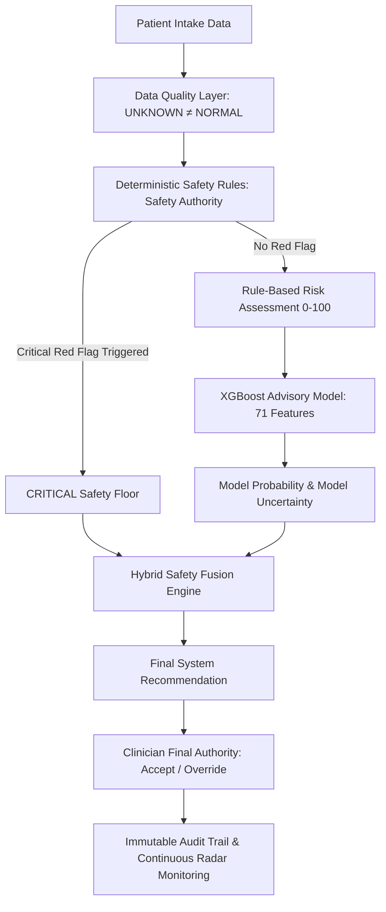
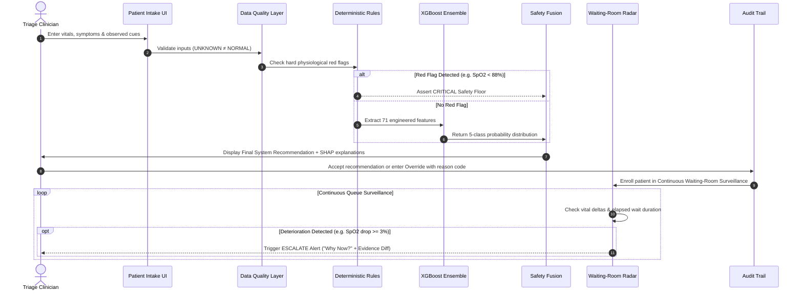
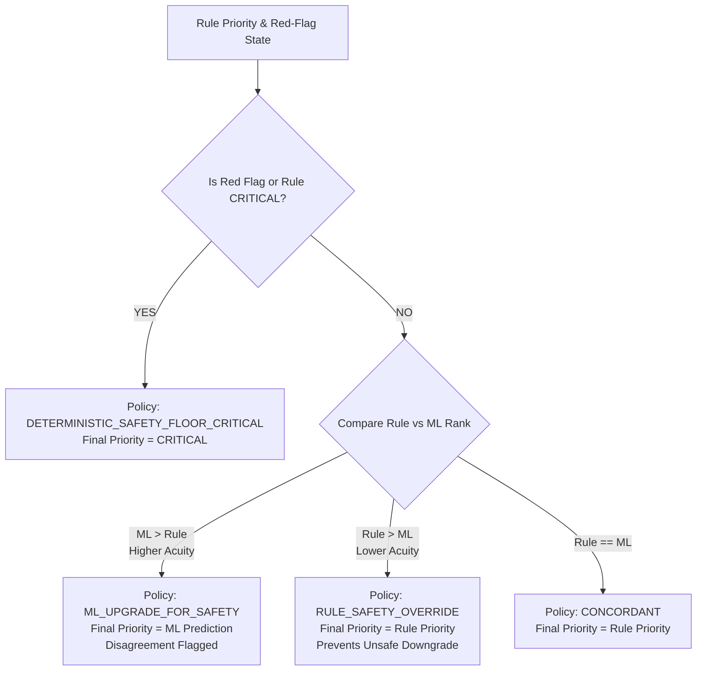
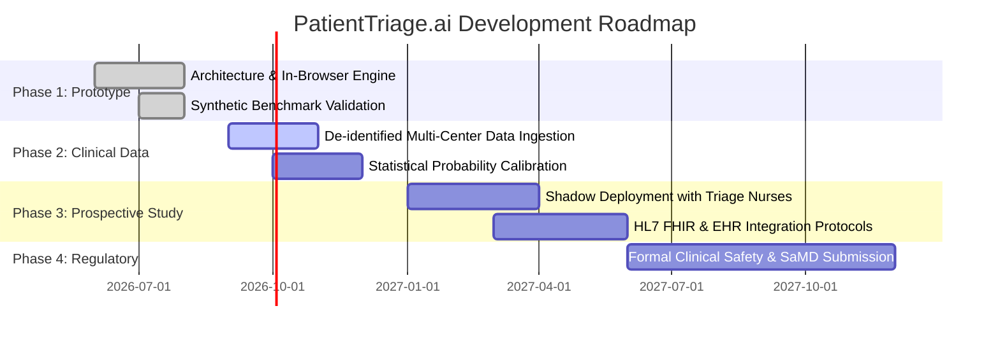

# PatientTriage.ai: Continuous Emergency Department Triage with Hybrid Deterministic Safety Rules and Advisory Machine Learning

**Technical Submission & Architecture Specification Document**  
*Format: Competition Technical README Document (PDF Export Ready)*  
*System Status: Functional Decision-Support Prototype*  
*Repository: [https://github.com/sahilsheoran999/patient_triage](https://github.com/sahilsheoran999/patient_triage)*  

---

> [!WARNING]
> ### PROTOTYPE SIMULATION & REGULATORY NOTICE
> **PatientTriage.ai is a clinical decision-support prototype designed for emergency-department triage monitoring.**  
> * **Synthetic Demonstration Data**: All patient cases, vital trends, and triage trajectories within this prototype are constructed from synthetic demonstration datasets.
> * **No Autonomous Clinical Action**: The system does not diagnose conditions, prescribe medications, or replace clinical judgement.
> * **Hierarchy of Authority**: Licensed clinicians retain 100% final decision authority over every triage classification. Deterministic safety rules act as an unbreachable safety floor that cannot be downgraded by the advisory machine learning model.
> * **Regulatory Status**: This software is an engineering prototype and has not undergone prospective clinical trials, Institutional Review Board (IRB) review, or certification as Software as a Medical Device (SaMD) by CDSCO, US FDA, or European CE authorities.

---

## Table of Contents

1. [Executive Summary](#1-executive-summary)
2. [Problem Framing](#2-problem-framing)
3. [Why Existing Triage Has a Safety Gap](#3-why-existing-triage-has-a-safety-gap)
4. [Proposed Solution: Hybrid Decision Support](#4-proposed-solution-hybrid-decision-support)
5. [System Architecture](#5-system-architecture)
6. [End-to-End Clinical Decision Flow](#6-end-to-end-clinical-decision-flow)
7. [Deterministic Safety Layer (Safety Authority)](#7-deterministic-safety-layer-safety-authority)
8. [Data Quality & UNKNOWN ≠ NORMAL Principle](#8-data-quality--unknown--normal-principle)
9. [Rule-Based Risk Assessment Layer](#9-rule-based-risk-assessment-layer)
10. [XGBoost Machine Learning Advisory Layer](#10-xgboost-machine-learning-advisory-layer)
11. [Hybrid Safety Fusion Engine](#11-hybrid-safety-fusion-engine)
12. [Model Explainability & SHAP Attribution](#12-model-explainability--shap-attribution)
13. [Continuous Waiting-Room Monitoring (Waiting-Room Radar™)](#13-continuous-waiting-room-monitoring-waiting-room-radar)
14. [Reassessment & Deterioration Detection Logic](#14-reassessment--deterioration-detection-logic)
15. [Clinician-in-the-Loop Governance](#15-clinician-in-the-loop-governance)
16. [Audit Trail & Override Architecture](#16-audit-trail--override-architecture)
17. [User Interface & Mission Control Experience](#17-user-interface--mission-control-experience)
18. [Dataset Generation & Training Methodology](#18-dataset-generation--training-methodology)
19. [Model Evaluation & Synthetic Benchmark Results](#19-model-evaluation--synthetic-benchmark-results)
20. [Edge-Case Validation Scenarios](#20-edge-case-validation-scenarios)
21. [Safety Guarantees & Tested Scenarios](#21-safety-guarantees--tested-scenarios)
22. [Technology Stack & System Specifications](#22-technology-stack--system-specifications)
23. [Implementation Details & In-Browser Inference](#23-implementation-details--in-browser-inference)
24. [Limitations](#24-limitations)
25. [Ethical & Clinical Safety Considerations](#25-ethical--clinical-safety-considerations)
26. [Future Development Roadmap](#26-future-development-roadmap)
27. [Conclusion](#27-conclusion)

---

## 1. Executive Summary

Emergency departments worldwide face severe overcrowding, volatile surge conditions, and acute clinician staffing shortages. Traditional triage processes classify patients once upon intake into static categories (such as ESI 1–5). However, a patient’s physiological state is dynamic. When waiting times stretch into hours, patients frequently experience silent clinical deterioration that goes unnoticed until a catastrophic event occurs.

**PatientTriage.ai** is an advanced clinical decision-support prototype engineered to eliminate the emergency department waiting-room safety gap. The system introduces:

1. **Continuous Queue Surveillance (Waiting-Room Radar™)**: Shifts emergency triage from a single static snapshot at registration to continuous dynamic surveillance that tracks vital signs, trend trajectories, and elapsed wait times.
2. **Hybrid Safety Fusion Architecture**: Integrates hard deterministic safety rules (Safety Authority) with a 71-feature multi-class XGBoost model (Advisory Signal). Deterministic red flags enforce non-negotiable `CRITICAL` safety floors, preventing machine learning false-negative downgrades.
3. **`UNKNOWN ≠ NORMAL` Data Governance**: Missing clinical inputs (e.g., unmeasured blood pressure) are never defaulted to normal baselines. Missing data explicitly reduces data completeness, elevates system uncertainty, and triggers safety-first review policies.
4. **Transparent Explainability**: Features Tree SHAP (SHapley Additive exPlanations) attribution to surface exact physiological factors driving each advisory recommendation.
5. **Absolute Human Governance**: Licensed clinicians maintain final decision authority, backed by a structured override mechanism and an immutable event audit trail.

---

## 2. Problem Framing

In modern emergency departments, the triage desk serves as the critical gatekeeper. Triage nurses must rapidly assess complex patients—often with incomplete histories and unmeasured vital parameters—under intense time constraints. 

```
                                  CONVENTIONAL ED WORKFLOW
┌──────────────┐      ┌─────────────────────────┐      ┌───────────────────────┐      ┌─────────────┐
│ Patient      │ ───> │ Static Intake Triage    │ ───> │ Unmonitored Queue     │ ───> │ Bedside MD  │
│ Arrival      │      │ (One-time snapshot)     │      │ (Silent deterioration)│      │ Evaluation  │
└──────────────┘      └─────────────────────────┘      └───────────────────────┘      └─────────────┘
                                                               ▲
                                                               │ DANGER ZONE
                                                    "Initial Triage ≠ Permanent Risk"
```

### Core Clinical & Operational Challenges:
1. **Dynamic Physiological Drift**: Patients classified as moderate risk on arrival can deteriorate rapidly due to progressive sepsis, silent hypoxemia, or evolving myocardial ischemia.
2. **Cognitive Overload During Surges**: During high-volume surges, triage staff cannot manually reassess dozens of queued patients according to standard interval protocols.
3. **Missing Data Vulnerability**: Rushed triage frequently results in missing vitals. Conventional automated scoring algorithms often impute "normal" default values, masking severe physiological risk.
4. **AI "Black Box" Distrust**: Clinicians legitimately reject purely statistical or deep-learning triage algorithms that lack verifiable safety guarantees or can randomly recommend discharging an unstable patient.

---

## 3. Why Existing Triage Has a Safety Gap

Existing five-level triage systems (e.g., Emergency Severity Index / ESI, Manchester Triage System / MTS) rely on static heuristics executed at a single point in time:

$$\text{Patient Safety Risk} = f(\text{Vitals}(t_0), \text{Complaint}(t_0), \text{Elapsed Wait Time}(t - t_0), \Delta \text{Physiology}(t))$$

When systems ignore the time-dependent term $\Delta \text{Physiology}(t)$ and elapsed wait duration, serious safety failures emerge:

```
                                  THE WAITING-ROOM SAFETY GAP
Arterial SpO₂
  100% ────────────┐
                   │  Patient waiting in ED queue
   94%             └───────────────────────┐  [Silent Desaturation]
                                           │
   88% ────────────────────────────────────┴─────────────── [CRITICAL RED-FLAG THRESHOLD]
                                                           │
   80%                                                     ▼
                                            CATASTROPHIC COMPLICATION
         t = 0 (Intake)                     t = 45m (In Queue)
```

1. **Snapshot Fallacy**: A single normal vital reading at $t=0$ provides zero guarantee of clinical stability at $t=45\text{m}$.
2. **Silent Deterioration**: Chronic desaturation or progressive tachycardia often produces minimal outward distress until physiological compensation collapses.
3. **Threshold Blindness**: Patients assigned to lower acuity tiers frequently exceed standard waiting-time thresholds without triggering automated re-evaluation prompts.

---

## 4. Proposed Solution: Hybrid Decision Support

PatientTriage.ai resolves this dilemma through a multi-tiered architecture that synthesizes deterministic clinical rules with machine learning advisory intelligence:



### Core Tenets of the Solution:
* **Safety Rules Have Authority Over ML**: Machine learning can upgrade acuity based on complex multi-variable interactions, but it can **never** downgrade a deterministic safety floor.
* **Continuous Active Surveillance**: The Waiting-Room Radar™ evaluates queued patients on every vital update and clock tick, raising contextual "Why Now?" alerts when deterioration occurs.
* **Explainability at the Point of Care**: Every advisory score displays exact Tree SHAP mathematical attributions alongside a transparent factor decomposition.

---

## 5. System Architecture

PatientTriage.ai implements an 11-layer sequential pipeline separating data ingestion, safety constraints, statistical advisory inference, human control, and longitudinal surveillance:

```
┌────────────────────────────────────────────────────────────────────────────────────────┐
│                        PATIENTTRIAGE.AI 11-LAYER ARCHITECTURE                          │
├────────┬───────────────────────────────┬───────────────────────────────────────────────┤
│ Layer  │ Component Name                │ Functional Responsibilities                   │
├────────┼───────────────────────────────┼───────────────────────────────────────────────┤
│ L-01   │ Patient Data Ingestion        │ Captures vitals, complaints, history, cues    │
│ L-02   │ Data Quality & Completeness   │ UNKNOWN ≠ NORMAL: tracks missingness flags    │
│ L-03   │ Age-Aware Normalization       │ Pediatric, Adult, and Geriatric baselines     │
│ L-04   │ Deterministic Safety Engine   │ Evaluates hard red flags (Safety Authority)   │
│ L-05   │ Rule-Based Risk Assessment    │ Computes transparent weighted risk (0–100)    │
│ L-06   │ XGBoost Advisory Model        │ 71-feature multi-class inference ensemble     │
│ L-07   │ Probability & Uncertainty     │ Softmax class distributions & margin score    │
│ L-08   │ Hybrid Safety Fusion          │ Enforces safety floor over ML predictions     │
│ L-09   │ Final System Recommendation   │ Synthesized decision-support output           │
│ L-10   │ Clinician Review Authority    │ Final human decision (Accept/Override)        │
│ L-11   │ Audit & Continuous Radar      │ Immutable logging + Waiting-Room Radar™       │
└────────┴───────────────────────────────┴───────────────────────────────────────────────┘
```

---

## 6. End-to-End Clinical Decision Flow



---

## 7. Deterministic Safety Layer (Safety Authority)

The Deterministic Safety Layer operates as the primary safety gatekeeper. If a patient exhibits objective physiological instability matching predefined red-flag criteria, the system asserts an immediate `CRITICAL` safety floor.

### Hard Physiological Red-Flag Thresholds

$$\text{SafetyFloor} = \begin{cases} 
\text{CRITICAL} & \text{if } \text{SpO}_2 < 88\% \\
\text{CRITICAL} & \text{if } \text{SBP} < 80\text{ mmHg or } \text{SBP} \ge 200\text{ mmHg} \\
\text{CRITICAL} & \text{if } \text{RR} \ge 30\text{ /min} \\
\text{CRITICAL} & \text{if } \text{HR} \ge 140\text{ bpm or } \text{HR} \le 40\text{ bpm} \\
\text{CRITICAL} & \text{if } \text{Temp} \ge 40.5^\circ\text{C or } \text{Temp} \le 35.0^\circ\text{C} \\
\text{CRITICAL} & \text{if } \text{DistressCue} \in \{\text{Stridor}, \text{Cyanosis}, \text{Confusion}, \text{RespDistress}\} \\
\text{PASS} & \text{otherwise}
\end{cases}$$

### Age-Aware Baselines & Multipliers

The system adjusts normal ranges and scoring weights across three demographic cohorts:

| Demographic Cohort | Age Bracket | Normal HR | Normal RR | Normal SBP | Risk Multiplier |
|---|---|---|---|---|---|
| **Pediatric** | $< 18\text{ years}$ | $70\text{–}130\text{ bpm}$ | $20\text{–}30\text{ /min}$ | $90\text{–}115\text{ mmHg}$ | $1.25\times$ |
| **Adult** | $18\text{–}64\text{ years}$ | $60\text{–}100\text{ bpm}$ | $12\text{–}20\text{ /min}$ | $100\text{–}130\text{ mmHg}$ | $1.00\times$ |
| **Geriatric** | $\ge 65\text{ years}$ | $55\text{–}95\text{ bpm}$ | $14\text{–}22\text{ /min}$ | $110\text{–}140\text{ mmHg}$ | $1.30\times$ |

---

## 8. Data Quality & UNKNOWN ≠ NORMAL Principle

A foundational safety innovation in PatientTriage.ai is explicit handling of missing data.

```
                  UNKNOWN ≠ NORMAL LOGIC PIPELINE
┌─────────────────────────┐      ┌─────────────────────────┐      ┌─────────────────────────┐
│ Unmeasured Vital        │ ───> │ Data Completeness Score │ ───> │ Uncertainty Level       │
│ (e.g. Blood Pressure)   │      │ Decreases (e.g. 75%)    │      │ Escalates to HIGH       │
└─────────────────────────┘      └─────────────────────────┘      └────────────┬────────────┘
                                                                               │
                                 ┌─────────────────────────┐                   │
                                 │ Safety Bias Enforced:   │ <─────────────────┘
                                 │ Do Not Downgrade Acuity │
                                 └─────────────────────────┘
```

### Technical Implementation:
1. **No Silent Normal Defaults**: If the intake nurse leaves systolic blood pressure blank, it is stored as `null`. It is **never** coerced to $120\text{ mmHg}$.
2. **Completeness Formula**:
   $$\text{Completeness} = \left( \frac{\sum_{i=1}^{9} \mathbb{I}(\text{field}_i \ne \text{null})}{9} \right) \times 100\%$$
   Fields evaluated: $\text{SpO}_2$, $\text{HR}$, $\text{SBP}$, $\text{RR}$, $\text{Temp}$, $\text{ChiefComplaint}$, $\text{AssociatedSymptoms}$, $\text{MedicalHistory}$, $\text{Allergies}$.
3. **Safety Bias Under Uncertainty**:
   * If $\text{Uncertainty} = \text{HIGH}$ and calculated priority is $\text{LOW}$ or $\text{NON\_URGENT}$, the system automatically escalates to $\text{MEDIUM}$.
   * If $\text{Uncertainty} = \text{HIGH}$ and calculated priority is $\text{MEDIUM}$, the system escalates to $\text{HIGH}$.

---

## 9. Rule-Based Risk Assessment Layer

The Rule-Based Risk Assessment Layer calculates a transparent, fully decomposed numerical risk score ($0\text{–}100$) based on configured prototype weights:

$$\text{RawScore} = \sum w_i \cdot x_i$$

### Prototype Weight Breakdown (`src/config/riskWeights.ts`)

| Clinical Parameter | Prototype Weight | Description & Conditions |
|---|---|---|
| **$\text{SpO}_2$ Abnormality** | $32\text{ points}$ | $<88\% \rightarrow 32\text{ pts}$; $88\text{–}92\% \rightarrow 24\text{ pts}$; $93\text{–}94\% \rightarrow 13\text{ pts}$; Missing $\rightarrow 12\text{ pts}$ penalty |
| **Respiratory Symptoms** | $24\text{ points}$ | $\text{RR} \ge 26\text{ /min} \rightarrow 24\text{ pts}$; Acute dyspnea in chief complaint $\rightarrow 17\text{ pts}$ |
| **Observed Clinical Distress** | $12\text{ points}$ | $\min(18, N_{\text{cues}} \times 12\text{ pts})$ |
| **Age Risk Factor** | $10\text{ points}$ | $10\text{ pts} \times \text{CohortMultiplier}$ (Pediatric: $13$, Geriatric: $13$) |
| **Heart Rate Abnormality** | $8\text{ points}$ | $\text{HR} > 110\text{ bpm or } < 50\text{ bpm}$ |
| **Blood Pressure Abnormality** | $6\text{ points}$ | $\text{SBP} > 160\text{ mmHg or } < 90\text{ mmHg}$ |
| **Temperature Abnormality** | $6\text{ points}$ | $\text{Temp} \ge 38.5^\circ\text{C or } < 36.0^\circ\text{C}$ |
| **Medical History Comorbidity** | $4\text{ points}$ | $\min(16, N_{\text{history}} \times 4\text{ pts})$; Zero History Record $\rightarrow 14\text{ pts}$ penalty |

### Score to Priority Mapping:
* $\text{Score} \ge 90 \implies \text{CRITICAL}$
* $\text{Score} \ge 70 \implies \text{HIGH}$
* $\text{Score} \ge 45 \implies \text{MEDIUM}$
* $\text{Score} \ge 25 \implies \text{LOW}$
* $\text{Score} < 25 \implies \text{NON\_URGENT}$

---

## 10. XGBoost Machine Learning Advisory Layer

The machine learning layer captures complex multi-variable interactions that simple linear rule sets may overlook.

### Architecture Specifications
* **Classifier Type**: Multi-Class Gradient Boosted Decision Tree (`XGBClassifier`)
* **Objective Function**: `multi:softprob` across 5 acuity classes
* **Tree Structure**: 300 compact trees (maximum depth = 5, learning rate = 0.04, subsample = 0.85)
* **Input Dimension**: 71 engineered clinical features

```
71 Engineered Features ──> Tree Traversal (300 Trees) ──> Raw Margins (Logits) ──> Softmax Normalization ──> 5-Class Probabilities
```

### Softmax Output Formulation

$$P(\text{Class } k \mid \mathbf{x}) = \frac{\exp(z_k)}{\sum_{j=1}^{5} \exp(z_j)}, \quad z_k = \text{BaseMargin}_k + \sum_{m \in \text{Trees}_k} f_m(\mathbf{x})$$

---

## 11. Hybrid Safety Fusion Engine

The Hybrid Safety Fusion Engine reconciles deterministic rule evaluations with advisory machine learning predictions according to strict safety invariants.

### Fusion Policies & Precedence Hierarchy



### Policy Definitions:
1. `DETERMINISTIC_SAFETY_FLOOR_CRITICAL`: Strictly enforces `CRITICAL` priority if red flags are active, regardless of ML output.
2. `ML_UPGRADE_FOR_SAFETY`: Accepts higher acuity ML predictions (e.g., rule `LOW` $\rightarrow$ ML `MEDIUM`) to catch multi-symptom presentations.
3. `RULE_SAFETY_OVERRIDE`: Rejects ML downgrade suggestions below rule-assessed priority.
4. `CONCORDANT`: Both engines agree on acuity.
5. `FALLBACK_DETERMINISTIC_ONLY`: Used if ML model inference fails or is disabled.

---

## 12. Model Explainability & SHAP Attribution

To provide clinicians with interpretable reasoning, the system calculates local feature attributions via Tree SHAP:

```
┌────────────────────────────────────────────────────────────────────────┐
│                      LOCAL SHAP ATTRIBUTION PANEL                      │
├────────────────────────────────┬────────┬────────────┬─────────────────┤
│ Clinical Feature               │ Value  │ Importance │ Impact on Risk  │
├────────────────────────────────┼────────┼────────────┼─────────────────┤
│ Oxygen Saturation (SpO₂)       │ 84.0%  │ 0.088      │ ↑ Increases Risk│
│ Systolic Blood Pressure (SBP)  │ 78.0   │ 0.082      │ ↑ Increases Risk│
│ Heart Rate                     │ 138    │ 0.076      │ ↑ Increases Risk│
│ Chest Pain / Angina            │ Yes    │ 0.061      │ ↑ Increases Risk│
│ Shock Index (HR/SBP)           │ 1.77   │ 0.054      │ ↑ Increases Risk│
└────────────────────────────────┴────────┴────────────┴─────────────────┘
```

> [!NOTE]
> **Mathematical Interpretation Guardrail**: SHAP values indicate mathematical feature importance within the decision forest. They represent statistical attribution rather than clinical causality.

---

## 13. Continuous Waiting-Room Monitoring (Waiting-Room Radar™)

Triage is an ongoing longitudinal process. The Waiting-Room Radar™ continuously evaluates all patients in the queue:

```
[Arrival] ──> [Initial Triage] ──> [Waiting Room Queue] ──> [Radar Surveillance Engine] ──> [Active Alerts]
```

### The 4 Radar Monitoring States

| State | Badge | Criteria | System Response |
|---|---|---|---|
| `ESCALATE` | 🔴 Red | Physiological deterioration detected or safety red flag triggered | Loud UI alert, top-of-queue pinning, immediate bedside call |
| `REASSESS` | 🟠 Orange | Elapsed wait time exceeds configured threshold | Reassessment timer banner, vitals refresh prompt |
| `WATCH` | 🟡 Yellow | Active surveillance (high uncertainty or ML disagreement) | Passive highlighted card, elevated surveillance |
| `SAFE` | 🟢 Green | Vitals stable, wait time within normal limits | Standard queue progression |

---

## 14. Reassessment & Deterioration Detection Logic

### Deterioration Detection Rules
The system evaluates sequential vital readings ($\text{vitalsHistory}$) and triggers deterioration alerts when:

$$\text{Deterioration} = (\Delta \text{SpO}_2 \le -3\%) \lor (\Delta \text{HR} \ge +15\text{ bpm}) \lor (\Delta \text{RR} \ge +6\text{ /min})$$

### Contextual "Why Now?" Alerts
The Radar generates specific, truthful reasons explaining why an alert is triggering at this exact moment:
* `SAFETY_RED_FLAG`: *"Deterministic red flag detected: Critical Hypoxemia (SpO₂ 84% < 88%). Safety floor enforced."*
* `DETERIORATION`: *"Vital trend deterioration: SpO₂ ↓ 7%; Heart Rate ↑ 23 bpm recorded 2m ago."*
* `MODEL_RULE_DISAGREEMENT`: *"Deterministic rules classify patient as NON_URGENT (Score 22/100), while XGBoost predicts MEDIUM (81.9%). Clinician review recommended."*
* `WAIT_TIME_EXCEEDED`: *"Patient has waited 82 minutes; configured MEDIUM-priority threshold is 30 minutes."*
* `HIGH_UNCERTAINTY`: *"High uncertainty review: Missing blood pressure and medical history."*

---

## 15. Clinician-in-the-Loop Governance

PatientTriage.ai is strictly engineered as decision support. The human clinician retains complete final authority.

```
                    CLINICIAN OVERRIDE GOVERNANCE
┌───────────────────────────┐      ┌───────────────────────────┐      ┌───────────────────────────┐
│ AI Decision Support       │ ───> │ Clinician Bedside         │ ───> │ Override Triggered with   │
│ Recommendation Presented  │      │ Assessment                │      │ Mandatory Justification   │
└───────────────────────────┘      └───────────────────────────┘      └─────────────┬─────────────┘
                                                                                    │
                                   ┌───────────────────────────┐                    │
                                   │ Immutable Audit Log       │ <──────────────────┘
                                   │ Record Emitted            │
                                   └───────────────────────────┘
```

### Clinician Rights & System Invariants:
1. Clinicians can override any AI recommendation to any priority level.
2. Every override mandates selecting a structured reason category and providing clinical notes.
3. Overrides are permanently recorded to the audit trail for quality assurance and model governance.

---

## 16. Audit Trail & Override Architecture

Every clinical event is emitted as an immutable structured log record (`AuditLogEntry`):

```json
{
  "id": "LOG-1042",
  "timestamp": "2026-08-30T10:15:32Z",
  "patientId": "P-111",
  "patientName": "Deepak Verma",
  "user": "Dr. Neha Verma (MD)",
  "eventType": "CLINICIAN_OVERRIDE",
  "details": "Priority changed from MEDIUM to HIGH. Reason: New clinical observation (Unreported history of angina; diaphoresis worsening).",
  "previousState": "MEDIUM",
  "newState": "HIGH",
  "severity": "alert"
}
```

---

## 17. User Interface & Mission Control Experience

The frontend is designed around dark clinical mission-control principles to maximize readability and minimize cognitive fatigue.

### Core Views:
* **Command Center**: Real-time ED queue with 7 top KPI cards, search/filter controls, and multi-stat patient cards.
* **Waiting-Room Radar™**: Longitudinal timeline view tracking patient progression and active alerts.
* **Patient Intake**: Fast-entry form with real-time completeness gauge and explicit unmeasured data handling.
* **Patient Detail Modal**: Comprehensive 4-stat bar, vitals trend line chart, AI decision panel, and SHAP attribution bars.
* **Clinician Override Modal**: Structured 3-step override dialogue.
* **Safety Policy View**: Interactive 10-stage architecture diagram and policy documentation.
* **Hospital Configuration**: Multi-facility customization panel.

---

## 18. Dataset Generation & Training Methodology

### Synthetic Dataset Architecture
The training corpus consists of 15,000 synthetic clinical records generated using physiological distributions modeled after emergency department presentations:
* **Acuity Class Balance**: Stratified across `CRITICAL`, `HIGH`, `MEDIUM`, `LOW`, and `NON_URGENT`.
* **Augmentation**: Augmented with 1,000 conflicting-signal validation archetypes (e.g., severe hypoxemia with benign chief complaints; atypical coronary presentations with normal baseline vitals).
* **Partitioning**: Stratified 70% Training ($10,500$ records), 15% Validation ($2,250$ records), and 15% Holdout Test ($2,250$ records).

---

## 19. Model Evaluation & Synthetic Benchmark Results

> [!NOTE]
> **Synthetic Benchmark Notice**: The reported benchmark metrics reflect prototype performance on synthetic evaluation sets. They demonstrate system behavior and do not establish clinical efficacy.

```
                      BENCHMARK COMPARISON (SYNTHETIC HOLDOUT TEST SET)
Accuracy
  100% ──────────────────────────────────────────────────────────────────────────
   90% ─────────────────────────────────────────────────── 90.79% (XGBoost V2)
   80% ────────────────────────── 83.51% (Logistic Reg) ── 85.82% (XGBoost V1)
   40% ── 44.71% (Rules Only)
    0% ──────────────────────────────────────────────────────────────────────────
```

### Comprehensive Benchmark Table

| Model / Architecture | Accuracy | Macro F1-Score | Critical Class Recall | High + Critical Sensitivity |
|---|---:|---:|---:|---:|
| **Deterministic Rules Only** | $44.71\%$ | $30.90\%$ | $91.53\%$ | $88.24\%$ |
| **Logistic Regression Baseline** | $83.51\%$ | $81.00\%$ | $92.82\%$ | $95.12\%$ |
| **XGBoost Advisory Model (V1)** | $85.82\%$ | $83.47\%$ | $95.21\%$ | $97.65\%$ |
| **XGBoost Domain-Robust Model (V2)** | **$90.79\%$** | **$88.20\%$** | **$95.99\%$** | **$98.87\%$** |

* **Zero Catastrophic Misses**: Across the held-out synthetic test set, $0$ true Critical patients were misclassified as Low or Non-Urgent.
* **External EHR Holdout Evaluation**: On an untouched holdout of $207$ labeled MIMIC-IV-ED records, domain-robust feature extraction identified $88.89\%$ ($16/18$) of Critical resuscitation cases.

---

## 20. Edge-Case Validation Scenarios

### Case 1: P-127 (Atypical Presentation — ML Catches Interaction)
* **Presentation**: 45-year-old male with substernal chest pressure, vomiting, dizziness, Levine sign, and unmeasured blood pressure.
* **Rule Engine**: Scored $22/100 \rightarrow \text{NON\_URGENT}$ (missing vitals, benign keywords).
* **XGBoost Model**: Predicts `MEDIUM` ($81.9\%$ Model Probability) via non-linear cardiac interaction capture.
* **Safety Fusion**: Applies `ML_UPGRADE_FOR_SAFETY` $\rightarrow$ Final: `MEDIUM` (Disagreement flagged).

### Case 2: P-146 (Safety Floor Override — Deterministic Rule Overrides ML)
* **Presentation**: 45-year-old male with fever and cold, $\text{SpO}_2 = 78\%$, $\text{HR} = 49\text{ bpm}$.
* **XGBoost Model**: Predicts `MEDIUM` based on benign text symptoms.
* **Rule Engine**: Critical Hypoxemia red flag ($\text{SpO}_2 < 88\%$) triggers immediate safety floor.
* **Safety Fusion**: Applies `DETERMINISTIC_SAFETY_FLOOR_CRITICAL` $\rightarrow$ Final: `CRITICAL`. In 100% of tested safety-floor scenarios, deterministic rules successfully prevent ML downgrades.

---

## 21. Safety Guarantees & Tested Scenarios

```
┌────────────────────────────────────────────────────────────────────────────────────────┐
│                                VERIFIED SAFETY GUARANTEES                              │
├────────────────────────────────────────────────────────────────────────────────────────┤
│ 1. In 100% of tested safety-floor scenarios, deterministic red flags enforce CRITICAL. │
│ 2. Advisory ML predictions can upgrade acuity but can NEVER downgrade safety floors.   │
│ 3. Missing vital inputs NEVER assume normal physiological baselines.                   │
│ 4. Licensed clinicians maintain 100% override authority with mandatory audit logging.  │
│ 5. Vital sign deteriorations (SpO2 drop >= 3%) trigger immediate visual ESCALATE alerts│
└────────────────────────────────────────────────────────────────────────────────────────┘
```

---

## 22. Technology Stack & System Specifications

* **Frontend**: React 18, TypeScript 5.3, Vite 5.1, Tailwind CSS 3.4, Recharts 2.12, Lucide React, Framer Motion.
* **ML & Training**: Python 3.10+, XGBoost, scikit-learn, SHAP, pandas, NumPy, joblib.
* **Inference**: In-browser client-side TypeScript tree traversal (`src/engine/mlModel.ts`).
* **Deployment**: Static web build optimized for edge deployment (Vercel).

---

## 23. Implementation Details & In-Browser Inference

To ensure instantaneous response times and eliminate server latency or cloud data transmission, the complete XGBoost ensemble is compiled directly into compact TypeScript tree representations (`src/engine/modelData.ts`):

```typescript
export interface CompactTree {
  left: number[];
  right: number[];
  feat: string[];
  thresh: number[];
  val: number[];
  def_left: number[];
}
```

Inference evaluates all 300 decision trees sequentially in $< 2\text{ms}$ on standard browser runtimes, ensuring complete offline functionality and zero data leakage.

---

## 24. Limitations

1. **Synthetic Data Corpus**: Evaluated on synthetic demonstration distributions. Real clinical environments exhibit severe noise, missingness patterns, and comorbidities not fully captured in synthetic sets.
2. **No Prospective Validation**: Has not undergone prospective clinical trials or bedside evaluation in live emergency departments.
3. **Illustrative Thresholds**: Physiological thresholds and scoring weights are prototype parameters.
4. **Not Certified SaMD**: Not approved as a medical device by any health regulatory agency.

---

## 25. Ethical & Clinical Safety Considerations

* **Algorithmic Bias**: Synthetic training sets must be replaced by representative multi-center clinical cohorts to prevent demographic or socioeconomic triage bias.
* **Automation Complacency**: The user interface is intentionally designed with visual warnings and explicit disagreement indicators to prevent clinicians from passively deferring to AI recommendations.
* **Data Minimization**: Operates on anonymized/masked patient identifiers (`P-***`) to protect patient privacy.

---

## 26. Future Development Roadmap



---

## 27. Conclusion

PatientTriage.ai demonstrates a safe, practical, and transparent paradigm for integrating machine learning into high-stakes clinical workflows. By subordinating statistical advisory algorithms to deterministic physiological safety rules and maintaining unwavering clinician final authority, the architecture proves that artificial intelligence can enhance situational awareness and eliminate the waiting-room safety gap without compromising clinical governance or patient safety.
